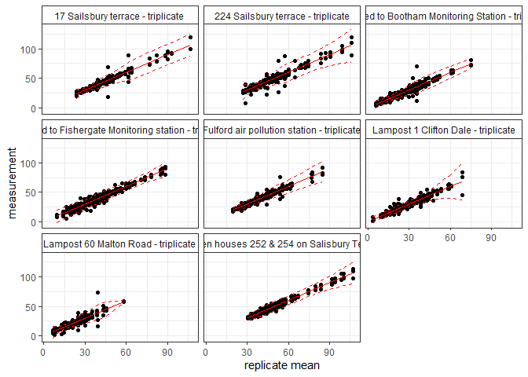

<!-- README.md is generated from README.Rmd. Please edit that file -->

R code for Diffusion Tube Data Evaluation.

**DTEval** is a package of R code used for the pro-processing, analysis
and evaluation of diffusion tube (DT) data typically collected in air
quality assessment exercises.

## Project Webpages

**DTEval** Projects pages: \[to be build once package is PUBLIC\]

## Installation

Get developer’s version of **DTEval** from [GitHub](https://github.com)
([archive](https://github.com/karlropkins/AQEval)) \[currently
PRIVATE\]:

``` r
# (if you do not have remotes package, install it from CRAN) 
# install.packages("remotes")
remotes::install_github("karlropkins/DTEval") 
```

If you have the **DTEval** .tar.gz file:

``` r
# install.packages("remotes")
remotes::install_local(file.choose()) # and select
```

## Background

This package contains code developed as part of an on-going project.

## Contributing

Contributions are very welcome.

## License

GPL-3

## Example

``` r
require(DTEval)
#> Loading required package: DTEval
```

### Using DT data from York City Council:

City of York Council / York Open Data

<https://data.yorkopendata.org/dataset/diffusion-tubes-data>

(downloaded 2024-12-02)

### DT Precision Test:

(Using all triplicate data)

``` r
testTubePrecision(dt.york, n=3, facet="SiteName")
```



    #> 'measurement' (rep = 3 subset):
    #>   |Outside house no.65 Wetherby Road| Insufficient replicates...
    #>   |Lampost 1 Cairnborrow off Moor Lane| Insufficient replicates...
    #>   |Nidd Close| Insufficient replicates...
    #>   |Top Lane, Copmanthorpe| Insufficient replicates...
    #>   |Beckfield Lane| Insufficient replicates...
    #>   |Trenchard Road -Boroughbridge Road| Insufficient replicates...
    #>   |Low Poppleton Lane| Insufficient replicates...
    #>   |Boroughbridge Road| Insufficient replicates...
    #>   |Millgates| Insufficient replicates...
    #>   |Wheatlands Ave| Insufficient replicates...
    #>   |The Paddock| Insufficient replicates...
    #>   |On "No Parking At Anytime" sign on RH Side of the entrance to Plantation Drive| Insufficient replicates...
    #>   |111 Boroughbridge Road, Drainpipe nearest Garage at side of the door| Insufficient replicates...
    #>   |Carr Lane| Insufficient replicates...
    #>   |Lampost 61 Shipton Road| Insufficient replicates...
    #>   |Drainpipe of 160 Carr Lane (replaced A37)| Insufficient replicates...
    #>   |Lampost outside 276 shipton Rd| Insufficient replicates...
    #>   |lampost 56 Shipton Road| Insufficient replicates...
    #>   |lampost outside 256/254 Shipton Road | Insufficient replicates...
    #>   |lampost 54 Shipton Road| Insufficient replicates...
    #>   |lampost outside 232/230 shipton rd| Insufficient replicates...
    #>   |Manor Lane - outside No.91| Insufficient replicates...
    #>   |lampost outside 206 Shipton Road -house line| Insufficient replicates...
    #>   |Lampost 49 Shipton road| Insufficient replicates...
    #>   |Blenheim Court| Insufficient replicates...
    #>   |Manor Drive North| Insufficient replicates...
    #>   |176 Shipton Road| Insufficient replicates...
    #>   |Lampost outside 168/166 Shipton Road (previously A76) | Insufficient replicates...
    #>   |lampost 42 Roadside Shipton Road| Insufficient replicates...
    #>   |Lampost opposite Longwood Dr (previously 60 tube)| Insufficient replicates...
    #>   |Poppleton Road School| Insufficient replicates...
    #>   |154 Shipton road| Insufficient replicates...
    #>   |140 Poppleton Road| Insufficient replicates...
    #>   |lampost 33 Poppleton Road (previously at 111 Poppleton Rd)| Insufficient replicates...
    #>   |Lampost 36 shipton road| Insufficient replicates...
    #>   |Chessingham Gardens| Insufficient replicates...
    #>   |Lampost 14, Acomb road - opposite church of latter day saints| Insufficient replicates...
    #>   |Poppleton Road| Insufficient replicates...
    #>   |120 Shipton Road| Insufficient replicates...
    #>   |Lampost 66 Tesco roundabout| Insufficient replicates...
    #>   |Just down from lampost 27, on the concrete post next to bench outside the allotments| Insufficient replicates...
    #>   |6 South Cottages| Insufficient replicates...
    #>   |Grantham Drive| Insufficient replicates...
    #>   |Old Moor Lane| Insufficient replicates...
    #>   |Chelwod Walk| Insufficient replicates...
    #>   |147 Tadcaster Rd| Insufficient replicates...
    #>   |St Swithens Walk| Insufficient replicates...
    #>   |Lampost 2 Hillary Garth off Renshaw Gardens, off Poppleton Road| Insufficient replicates...
    #>   |Middlethorpe Grove| Insufficient replicates...
    #>   |110 Tadcaster Road| Insufficient replicates...
    #>   |Sailsbury Road| Insufficient replicates...
    #>   |St Helen's Road, Dringhouses| Insufficient replicates...
    #>   |Lampost C13 Shipton Road Opposite Dormouse Pub| Insufficient replicates...
    #>   |Slingsby Grove| Insufficient replicates...
    #>   |Lindley street| Insufficient replicates...
    #>   |5 Salisbury Road| Insufficient replicates...
    #>   |9 Poppleton Road| Insufficient replicates...
    #>   |Post 10 Livingstone Street. Opposite Post Office| Insufficient replicates...
    #>   |70 Shipton Road| Insufficient replicates...
    #>   |Livingstone Street| Insufficient replicates...
    #>   |Cherry Lane| Insufficient replicates...
    #>   |Garfield Terrace| Insufficient replicates...
    #>   |17 Sailsbury terrace - triplicate| mean: 43.31 (23.91 to 106.5) precision: -16.13[%] to 16.13[%]
    #>   |Entrance to Heathers| Insufficient replicates...
    #>   |Outside Fox pub - Holgate Rd| Insufficient replicates...
    #>   |Drainpipe of 34 Tadcaster Road| Insufficient replicates...
    #>   |224 Sailsbury terrace - triplicate| mean: 46.52 (27.28 to 106) precision: -19.45[%] to 19.45[%]
    #>   |Lincoln Street| Insufficient replicates...
    #>   |Kingsland Terrace| Insufficient replicates...
    #>   |Curzon Lodge Hotel| Insufficient replicates...
    #>   |42 Shipton Road| Insufficient replicates...
    #>   |outside 36 Shipton Road| Insufficient replicates...
    #>   |Lampost 1 Ainsty Grove| Insufficient replicates...
    #>   |Thrall entrance| Insufficient replicates...
    #>   |Aldborough Way| Insufficient replicates...
    #>   |Brunel Court| Insufficient replicates...
    #>   |Opposite Marroitt Hotel| Insufficient replicates...
    #>   |Holly bank| Insufficient replicates...
    #>   |Shipton Road| Insufficient replicates...
    #>   |Lampost 1 Nelson's Lane| Insufficient replicates...
    #>   |Holgate Road (cornor of Hamilton Dr East)| Insufficient replicates...
    #>   |Chalfonts| Insufficient replicates...
    #>   |Pulleyn Dr| Insufficient replicates...
    #>   |Leeman Road| Insufficient replicates...
    #>   |Water End| Insufficient replicates...
    #>   |Holgate Road| Insufficient replicates...
    #>   |248 Tadcaster Rd| Insufficient replicates...
    #>   |St Georges Place| Insufficient replicates...
    #>   |Lampost 2 Rawcliffe Lane near junction with Brompton Road| Insufficient replicates...
    #>   |196 Mount Vale| Insufficient replicates...
    #>   |Lampost 25 Shipton Rd | Insufficient replicates...
    #>   |Lampost 7 Clifton Green| Insufficient replicates...
    #>   |Signpost at end of Dalton Terrace| Insufficient replicates...
    #>   |Trentholme Dr| Insufficient replicates...
    #>   |Elmbank hotel| Insufficient replicates...
    #>   |Lime Tree House| Insufficient replicates...
    #>   |Outside Inglewood Hotel, Clifton Green (previously 60 tube)| Insufficient replicates...
    #>   |Traffic light outside Bonners Guest house - replacement for A10| Insufficient replicates...
    #>   |Lampost 1 Clifton Dale - triplicate| mean: 27.02 (3.825 to 68.47) precision: -24.39[%] to 24.39[%]
    #>   |Traffic lights end of Water Lane| Insufficient replicates...
    #>   |Drainpipe front of Greenside guest house| Insufficient replicates...
    #>   |Lampost 3, Water Lane| Insufficient replicates...
    #>   |Dalton Terrace (relocated to Albermarle road/The mount junction July2001)| Insufficient replicates...
    #>   |51 Clifton| Insufficient replicates...
    #>   |Pedestrian crossing on junction of Scarcroft Road/The Mount| Insufficient replicates...
    #>   |Jarvis Abbey Park| Insufficient replicates...
    #>   |Hairdressers Holgate Road| Insufficient replicates...
    #>   |Clifton Bingo Hall| Insufficient replicates...
    #>   |The Mount| Insufficient replicates...
    #>   |Park Street| Insufficient replicates...
    #>   |East Mount Road| Insufficient replicates...
    #>   |The Crescent| Insufficient replicates...
    #>   |Opposite Burton Stone Lane junction| Insufficient replicates...
    #>   |Outside Odean| Insufficient replicates...
    #>   |Drainpipe of house 18 Queen St| Insufficient replicates...
    #>   |Bus Stop E outside Royal York Hotel| Insufficient replicates...
    #>   |St Olaves Road| Insufficient replicates...
    #>   |Jamieson Terrace| Insufficient replicates...
    #>   |Windmill Pub| Insufficient replicates...
    #>   |Lampost top of Nunnery Lane Car Park (previously 60 tube survey)| Insufficient replicates...
    #>   |Priory St sign Micklegate| Insufficient replicates...
    #>   |WRVS building -Bootham| Insufficient replicates...
    #>   |Burton Stone Lane| Insufficient replicates...
    #>   |Drainpipe on front of registry office| Insufficient replicates...
    #>   |Rougier Street Signpost 1, has Except for Access sign on it.| Insufficient replicates...
    #>   |Attached to Bootham Monitoring Station - triplicate| mean: 24.28 (5.738 to 74.84) precision: -27.75[%] to 27.75[%]
    #>   |Lamppost outside Charlie Browns| Insufficient replicates...
    #>   |Outside Museum Gardens| Insufficient replicates...
    #>   |Bridge St/ Micklegate Junction| Insufficient replicates...
    #>   |Lampost 16 Nunnery Lane| Insufficient replicates...
    #>   |Lampst 27 Bishopthorpe Road near junction with Balmoral Terrace| Insufficient replicates...
    #>   |Lampost 17 Nunnery Lane outside 81| Insufficient replicates...
    #>   |Lampost 2 Scarcroft Rd| Insufficient replicates...
    #>   |Bootham traffic light outside dance shop| Insufficient replicates...
    #>   |Museum Street| Insufficient replicates...
    #>   |Drainpipe to right of door of 2 St Leonards Place| Insufficient replicates...
    #>   |Outside De Grey House right hand side of side entrance gate post| Insufficient replicates...
    #>   |Intake Ave/Lucas Ave| Insufficient replicates...
    #>   |Drainpipe of house 22, Prices Lane| Insufficient replicates...
    #>   |Lampost 7 Bishopthorpe Road, opposite entrance to Charlton St| Insufficient replicates...
    #>   |Gillygate air pollution station| Insufficient replicates...
    #>   |Gillygate air pollution station - duplicate| Insufficient replicates...
    #>   |Lampost 3, Bishopthorpe Road, outside house 26| Insufficient replicates...
    #>   |Prices Lane| Insufficient replicates...
    #>   |Portland Street| Insufficient replicates...
    #>   |Portland Street - duplicate| Insufficient replicates...
    #>   |Gillygate Surgery| Insufficient replicates...
    #>   |Papillion hotel - Gillygate| Insufficient replicates...
    #>   |Lampost 1 Bishopthorpe Road| Insufficient replicates...
    #>   |Gillygate opposite Portland Street| Insufficient replicates...
    #>   |Lampost 3 Bishopgate Street - next to bench| Insufficient replicates...
    #>   |Lampost 4 Skeldergate, opposite City Mills| Insufficient replicates...
    #>   |Drainpipe of 55 Lord Mayor's Walk| Insufficient replicates...
    #>   |Lamp-post 1 Feversham Crescent| Insufficient replicates...
    #>   |Wigginton Road| Insufficient replicates...
    #>   |Clarence St| Insufficient replicates...
    #>   |Low Ousegate / Clifford St  junction, outside Waterstones| Insufficient replicates...
    #>   |No entry sign outside Barrats Shoe Shop, St Sampsons Sq| Insufficient replicates...
    #>   |Lampost 6 Clifford St opposite Peckitt Street| Insufficient replicates...
    #>   |Drainpipe of Daisy Taylors Card Shop, Kings Square| Insufficient replicates...
    #>   |Lamp-post 4 Haxby Road| Insufficient replicates...
    #>   |Lampost 8, Lord Mayor's Walk outside no 34| Insufficient replicates...
    #>   |Lampost 1 - Ogleforth| Insufficient replicates...
    #>   |Lampost 2, The Stonebow - outside Jorvick caf| Insufficient replicates...
    #>   |Lampost 11 Lord Mayor's Walk - opposite bike shop| Insufficient replicates...
    #>   |On signpost outside 26 Fossgate| Insufficient replicates...
    #>   |Drainpipe of Margaret Phillipson Court, Aldwalk| Insufficient replicates...
    #>   |Piccadilly/ Merchantgate junction| Insufficient replicates...
    #>   |Haxby Road (nr Whitecross Rd)| Insufficient replicates...
    #>   |Haxby Main Street| Insufficient replicates...
    #>   |Fulford Court| Insufficient replicates...
    #>   |Lampost 2 Fishergate - near Chapel Kitchen Shop| Insufficient replicates...
    #>   |Lampost 14 Piccadilly (near Travellodge)| Insufficient replicates...
    #>   |Lampost 6 The Stonebow Opposite Windsors World of Shoes| Insufficient replicates...
    #>   |Lampost 8 Monkgate Cloisters| Insufficient replicates...
    #>   |Lampost 8 Jewbury| Insufficient replicates...
    #>   |Lampost 1 , Paragon St| Insufficient replicates...
    #>   |Lampost 2 St Deny's Road - outside hotel| Insufficient replicates...
    #>   |Peasholme Green outside hostel| Insufficient replicates...
    #>   |Attached to Fishergate Monitoring station - triplicate| mean: 38.42 (9.562 to 88.17) precision: -23.74[%] to 23.74[%]
    #>   |Escrick St| Insufficient replicates...
    #>   |Lampost 4 outside The Garden of India restaurant on Fawcett Street| Insufficient replicates...
    #>   |Winterscale St| Insufficient replicates...
    #>   |Lampost 5 inside grounds of Kent St Car Park| Insufficient replicates...
    #>   |Haleys Terrace (previously Longwood Road)| Insufficient replicates...
    #>   |Lampost outside Barbican Centre| Insufficient replicates...
    #>   |Haxby Road (Haxby Gates)| Insufficient replicates...
    #>   |Lamppost 1  Lowther Street opposite Riverside House Flats| Insufficient replicates...
    #>   |Telegraph pole 825 Maple Gr| Insufficient replicates...
    #>   |Fulford Cross| Insufficient replicates...
    #>   |Howard St| Insufficient replicates...
    #>   |300 Fulford Rd| Insufficient replicates...
    #>   |Alma terrace| Insufficient replicates...
    #>   |114 Huntington Road| Insufficient replicates...
    #>   |Lampost 39 Fulford Rd - triplicate| Insufficient replicates...
    #>   |Lampost 39 Fulford Road - triplicate| Insufficient replicates...
    #>   |Conservative Club| Insufficient replicates...
    #>   |Lampost 24 Fulford Rd| Insufficient replicates...
    #>   |Derwent Rd| Insufficient replicates...
    #>   |Lampost 42 Fulford Road| Insufficient replicates...
    #>   |New Earswick| Insufficient replicates...
    #>   |Lampost 15 Huntington Road outside no 67| Insufficient replicates...
    #>   |Lampost 46 opposite Waterside Gardens. New site to replace B7| Insufficient replicates...
    #>   |Adams House B&B| Insufficient replicates...
    #>   |Lampost 7 Huntington Road opposite Park Grove| Insufficient replicates...
    #>   |Drainpipe of 4 Main Street Fulford| Insufficient replicates...
    #>   |Lampost 11 Huntington Road outside no 70| Insufficient replicates...
    #>   |18 Main St| Insufficient replicates...
    #>   |Lampost  Dalguise Grove| Insufficient replicates...
    #>   |Lampost 9 Barbican road outside house no.24| Insufficient replicates...
    #>   |First lampost on Navigation Road| Insufficient replicates...
    #>   |Lampost 1 Byland Avenue| Insufficient replicates...
    #>   |lampost 8 Main St| Insufficient replicates...
    #>   |59 Main St| Insufficient replicates...
    #>   |50 Main St| Insufficient replicates...
    #>   |Lampost 3 Barbican Road outside house no 7| Insufficient replicates...
    #>   |124 Main St| Insufficient replicates...
    #>   |103 Main St| Insufficient replicates...
    #>   |Drainpipe of Edward VII pub - Nunnery Lane| Insufficient replicates...
    #>   |Lampost outside house closest to Tyre Shop on Foss Islands Rd| Insufficient replicates...
    #>   |Front of York Cycleworks| Insufficient replicates...
    #>   |Lampost 1 Villa Grove| Insufficient replicates...
    #>   |Lampost 3 outside 7 Lawrence Street| Insufficient replicates...
    #>   |Fordlands Rd| Insufficient replicates...
    #>   |Lampost 1 Brookfield Road| Insufficient replicates...
    #>   |Lampost 1 Brandsby Road| Insufficient replicates...
    #>   |Lampost 1 Whitestone Drive| Insufficient replicates...
    #>   |Lampost 61 Huntington Road next to 300 Huntington Road| Insufficient replicates...
    #>   |Lampost 2 Selby Rd| Insufficient replicates...
    #>   |On drainpipe on front of Heworth Surgery.| Insufficient replicates...
    #>   |2 Selby Rd| Insufficient replicates...
    #>   |Lampost 34 Selby Road| Insufficient replicates...
    #>   |House top of Selby Rd| Insufficient replicates...
    #>   |Lampost 1 Stratford Way| Insufficient replicates...
    #>   |Lampost 24 Outside No.55 Heworth Green| Insufficient replicates...
    #>   |Telegraph pole 858 end of Yearsley Grove| Insufficient replicates...
    #>   |Lampost 99 Huntington Road| Insufficient replicates...
    #>   |76 Lawrence Street| Insufficient replicates...
    #>   |Lampost 14 Outside 112 Heslington Lane| Insufficient replicates...
    #>   |Heworth Court Hotel sign outside Sutherland House on side of house on drainpipe.| Insufficient replicates...
    #>   |83 Lawrence Street| Insufficient replicates...
    #>   |Eastern Terrace| Insufficient replicates...
    #>   |Relocated - Lampost 109 outside house number 540 (opposite the shop)| Insufficient replicates...
    #>   |Lampost 24 outside North East Guide Association.| Insufficient replicates...
    #>   |117 Lawrence Street| Insufficient replicates...
    #>   |Lampost 1 corner of Heworth Green| Insufficient replicates...
    #>   |Drainpipe 6 Stockton Lane - nr Heworth Rd roundabout| Insufficient replicates...
    #>   |Lampost 114 Huntington Rd outside 572A| Insufficient replicates...
    #>   |Heath Croft| Insufficient replicates...
    #>   |Outside nursing home, Lawrence Street| Insufficient replicates...
    #>   |Heworth Road - Lamppost 6| Insufficient replicates...
    #>   |Lampost 26 Malton Road| Insufficient replicates...
    #>   |Lampost 1 Elmfield Terrace| Insufficient replicates...
    #>   |lampost 1 North Moor Rd| Insufficient replicates...
    #>   |Heworth Rd/East Parade junction| Insufficient replicates...
    #>   |Lampost 46 outside house no 256 - New Lane, Huntington| Insufficient replicates...
    #>   |Lampost 1 Elmfield Avenue| Insufficient replicates...
    #>   |Lampost 24 North Moor Road at end of Broome Close| Insufficient replicates...
    #>   |Pedestrian crossing Traffic Light Melrosegate Crossroads| Insufficient replicates...
    #>   |62 North Moor Road | Insufficient replicates...
    #>   |Drainpipe 27 Melrosegate| Insufficient replicates...
    #>   |Lampost 1 White Horse Close| Insufficient replicates...
    #>   |Lampost 5 outside Huntington Primary School| Insufficient replicates...
    #>   |First lampost on Abbots Gait| Insufficient replicates...
    #>   |Millfield Avenue| Insufficient replicates...
    #>   |Lampost 34 Fifth Ave junction with Melrosegate| Insufficient replicates...
    #>   |Strensall Road| Insufficient replicates...
    #>   |47 Hull Road| Insufficient replicates...
    #>   |Lampost 15 Forge Close, Jockey Lane (previously Parliament St)| Insufficient replicates...
    #>   |61 Hull Road| Insufficient replicates...
    #>   |Lampost 16 Hull Road| Insufficient replicates...
    #>   |Telegraph Pole 938 at Junction of New Lane Huntington & Malton Road.| Insufficient replicates...
    #>   |134 Hull Road| Insufficient replicates...
    #>   |Lampost 1 Milson Grove| Insufficient replicates...
    #>   |117 Hull Road| Insufficient replicates...
    #>   |Lilac Avenue| Insufficient replicates...
    #>   |Lampost 29 Hull Road (previously at 165 Hull Road)| Insufficient replicates...
    #>   |Lampost 60 Malton Road - triplicate| mean: 21.97 (6.375 to 58.01) precision: -29.86[%] to 29.86[%]
    #>   |Drainpipe to the left of the front door on 167 Hull Road| Insufficient replicates...
    #>   |Lampost 54 Tang Hall Lane| Insufficient replicates...
    #>   |Heslington Main Street (previously 61)| Insufficient replicates...
    #>   |205 Hull Road| Insufficient replicates...
    #>   |Lampost 40 Hull Road (Year 1 lampost 39)| Insufficient replicates...
    #>   |231 Hull Road| Insufficient replicates...
    #>   |Lampost 45 Hull Road (Year 1 lampost 43)| Insufficient replicates...
    #>   |Lampost 1 Yarborough Way| Insufficient replicates...
    #>   |Lampost 1 Nursery Gardens| Insufficient replicates...
    #>   |Telegraph pole outside 267 Hull Road| Insufficient replicates...
    #>   |Lampost 62 Hull Road (Year 1 lampost 63)| Insufficient replicates...
    #>   |Telegraph pole outside 279 Hull Road| Insufficient replicates...
    #>   |Lampost 8 Yarborough Way| Insufficient replicates...
    #>   |Lampost 1 Yew Tree Mews Osbaldwick Village| Insufficient replicates...
    #>   |Lampost 70 Hull Road| Insufficient replicates...
    #>   |Telegraph pole 1 Hull Road outside 289| Insufficient replicates...
    #>   |Telegraph pole 1A, opposite school/nursery, Murton Way, Osbaldwick| Insufficient replicates...
    #>   |Canham Grove| Insufficient replicates...
    #>   |Lampost 2 Low Mill Close - off Field Lane| Insufficient replicates...
    #>   |Telegraph pole 97 outside 323 Hull Road| Insufficient replicates...
    #>   |482 Malton Road| Insufficient replicates...
    #>   |Lampost 142 Top of Hull Road Near Grimston Bar Roundabout| Insufficient replicates...
    #>   |Lampost 16 Heworth Green, next to Air Quality Station| Insufficient replicates...
    #>   |Lampost 7 Outside St Lawrences Working Mans Club| Insufficient replicates...
    #>   |Lampost Church Close, Askham Bryan| Insufficient replicates...
    #>   |Lampost Opposite Montaque Street on Cambleshon Road| Insufficient replicates...
    #>   |Lampost 12 Layerthorpe, opposite flats| Insufficient replicates...
    #>   |On NO PARKING SIGN just over bridge on left hand side on Hallfield Road| Insufficient replicates...
    #>   |Lampost outside Renshaw House| Insufficient replicates...
    #>   |Opposite side of the road from Pocklington carpets on lampost.| Insufficient replicates...
    #>   |Telegraph Pole 381 Hull Road| Insufficient replicates...
    #>   |Lampost 71 Hull Road| Insufficient replicates...
    #>   |Rufforth Village| Insufficient replicates...
    #>   |Rufforth Playing Fields| Insufficient replicates...
    #>   |A59 Opposite Wyevale Garden Centre| Insufficient replicates...
    #>   |House Near A59 Ringroad Roundabout| Insufficient replicates...
    #>   |Signpost between houses 252 & 254 on Salisbury Terrace - triplicate| mean: 49.14 (30.33 to 107.1) precision: -15.5[%] to 15.5[%]
    #>   |Wiggington Road near the ringroad roundabout| Insufficient replicates...
    #>   |Fulford air pollution station - triplicate| mean: 37.61 (19.44 to 84.66) precision: -17.14[%] to 17.14[%]
    #>   |Heslington Lane| Insufficient replicates...
    #>   |Signpost corner of 21 Salisbury Terrace| Insufficient replicates...
    #>   |Inbetween corner shop & betting office| Insufficient replicates...
    #>   |On signpost opposite side of road from 200 Salisbury Terrace| Insufficient replicates...
    #>   |Drainpipe outside 20 Toft Green (Motorbike shop)| Insufficient replicates...
    #>   |Lampost opposite Tru Nightclub Toft Green| Insufficient replicates...
    #>   |Lampost outside St Gregorys Mews, opposite Council HQ Toft Green| Insufficient replicates...
    #>   |Lampost at side of Cedar Court opposite entrance to Multistorey Car Park on Tanner Row| Insufficient replicates...
    #>   |Signpost outside 16 Rougier Street| Insufficient replicates...
    #>   |Signpost inbetween Club Salvation & 31 George Hudson Street| Insufficient replicates...
    #>   |Lampost 1 Fishergate| Insufficient replicates...
    #>   |Telegraph Pole at entrance to Knapton Lane off Beckfield Lane| Insufficient replicates...
    #>   |111 Poppleton Road, drainpipe to the right of the door| Insufficient replicates...
    #>   |Clifton Green Lampost 3| Insufficient replicates...
    #>   |Burton Stone Lane Lampost 17 outside No.142| Insufficient replicates...
    #>   |Inside Bus Stop  opposite side of road from tube 114| Insufficient replicates...
    #>   |Bus Stop outside Society bar/cafe Rougier Street| Insufficient replicates...
    #>   |Maple Grove Lampost 1| Insufficient replicates...
    #>   |Telegraph Pole outside 52 Heath Moor Drive| Insufficient replicates...
    #>   |Telegraph Pole Outside 88 Station Road Poppleton| Insufficient replicates...
    #>   |Ousecliffe Gardens signpost, outside 31 Water End| Insufficient replicates...
    #>   |East Mount Road, opposite side of road from old tube| Insufficient replicates...
    #>   |Burton Stone Lane Lampost 13 Outside no.138| Insufficient replicates...
    #>   |Telegraphpole outside 59 Huntington Road| Insufficient replicates...
    #>   |Inside Taxi Rank @ York Railway Station| Insufficient replicates...
    #>   | Drainpipe side of Cardshop Coppergate| Insufficient replicates...
    #>   |Osbaldwick Derwenthorpe| Insufficient replicates...
    #>   |New Tube (Osbalwick Parish Council) nr Bridge| Insufficient replicates...
    #>   |Drainpipe to front of 88 Station Road| Insufficient replicates...
    #>   |Lampost next to Air Quality Monitoring Station on Plantation Drive| Insufficient replicates...
    #>   |Drainpipe between 7-9 Livingstone Street| Insufficient replicates...
    #>   |1 St Edwards Close| Insufficient replicates...
    #>   |Museum Street - Opposite Thomas's Pub| Insufficient replicates...
    #>   |58 Nunnery Lane| Insufficient replicates...
    #>   |76 Nunnery Lane| Insufficient replicates...
    #>   |Lampost 3 Kent Street at side of car park| Insufficient replicates...
    #>   |Lampost to left of 102 Layerthorpe (flats)| Insufficient replicates...
    #>   |11 Lawrence Street| Insufficient replicates...
    #>   |Outside old DC Cook site on signpost| Insufficient replicates...
    #>   |Bus Stop outside 8/9 SLP| Insufficient replicates...
    #>   |No entry sign ourside Schuh Shoe Shop| Insufficient replicates...
    #>   |Three Tuns Pub, 12 Coppergate| Insufficient replicates...
    #>   |Lampost 4, Pedestrian Crossing, Coppergate| Insufficient replicates...
    #>   |Traffic lights, opposite Duttons, Coppergate| Insufficient replicates...
    #>   |Site relocated from Low Mill Close (new from April 2015)| Insufficient replicates...
