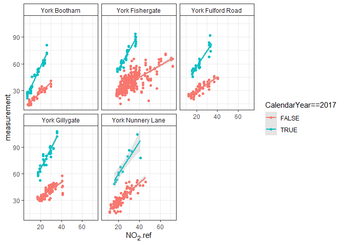

<!-- README.md is generated from README.Rmd. Please edit that file -->

R code for Diffusion Tube Data Evaluation.

**DTEval** is a package of R code used for the pro-processing, analysis
and evaluation of diffusion tube (DT) data typically collected in air
quality assessment exercises.

## Project Webpages

**DTEval** Projects pages: \[to be build once package is PUBLIC\]

## Installation

Get developer’s version of **DTEval** from [GitHub](https://github.com)
([archive](https://github.com/karlropkins/DTEval)) \[currently
PRIVATE\]:

``` r
# (if you do not have remotes package, install it from CRAN) 
# install.packages("remotes")
remotes::install_github("karlropkins/DTEval") 
```

If you have the **DTEval** .tar.gz file:

``` r
# install.packages("remotes")
remotes::install_local(file.choose()) # and select
```

## Background

This package contains code developed as part of an on-going project.

## Contributing

Contributions are very welcome.

## License

GPL-3

## Introduction Slides

[currently
here](https://github.com/karlropkins/DTEval/blob/main/docs/slides/DTEval-Introduction.pdf)

## Example

(using unpackaged data…)

``` r
require(DTEval)
#> Loading required package: DTEval
```

### Get local reference data for York:

``` r
#AURN sites: YK10-11
#AQE sites: YK7-9, YK13, YK15-16
#(using openair and dplyr) 

ref.york <- dplyr::bind_rows(
  openair::importAURN(c("YK10", "YK11"), year=2005:2023, meta=TRUE),
  openair::importAQE(c("YK7", "YK8", "YK9", "YK13", "YK15", "YK16"), 
                     year=2005:2023, meta=TRUE)
)
```

### Compare DT and reference data

``` r
#DT data packaged as dt.york 
#source City of York Council / York Open Data
#https://data.yorkopendata.org/dataset/diffusion-tubes-data 
#(downloaded 2024-12-02)

dt.york <- dont.share::dt.york

testTubeAccuracy(dt.york, ref.york, 
                 tube="measurement", ref="no2", 
                 facet="site.ref", 
                 col="CalendarYear==2017",
                 group="CalendarYear==2017")
```



    #> 'measurement' vs. 'no2.ref' (dist < 10):
    #>   |FALSE|York Bootham| 4.753 + 1.136*[ref]   (adj.r^2 0.9112)
    #>   |TRUE|York Bootham| 6.451  + 2.503*[ref]   (adj.r^2 0.9445)
    #>   |FALSE|York Fishergate| 17.78  + 0.6738*[ref]  (adj.r^2 0.5272)
    #>   |TRUE|York Fishergate| 12.5    + 2.065*[ref]   (adj.r^2 0.9148)
    #>   |FALSE|York Nunnery Lane| 7.663    + 1.053*[ref]   (adj.r^2 0.7568)
    #>   |TRUE|York Nunnery Lane| 23.42 + 1.817*[ref]   (adj.r^2 0.7588)
    #>   |FALSE|York Fulford Road| 13.39    + 0.7908*[ref]  (adj.r^2 0.7613)
    #>   |TRUE|York Fulford Road| 21.22 + 1.77*[ref]    (adj.r^2 0.8772)
    #>   |FALSE|York Gillygate| 17.3    + 0.8247*[ref]  (adj.r^2 0.5822)
    #>   |TRUE|York Gillygate| 19.03    + 2.314*[ref]   (adj.r^2 0.8845)

(not keeping this example BUT maybe wrong units in 2017?)
